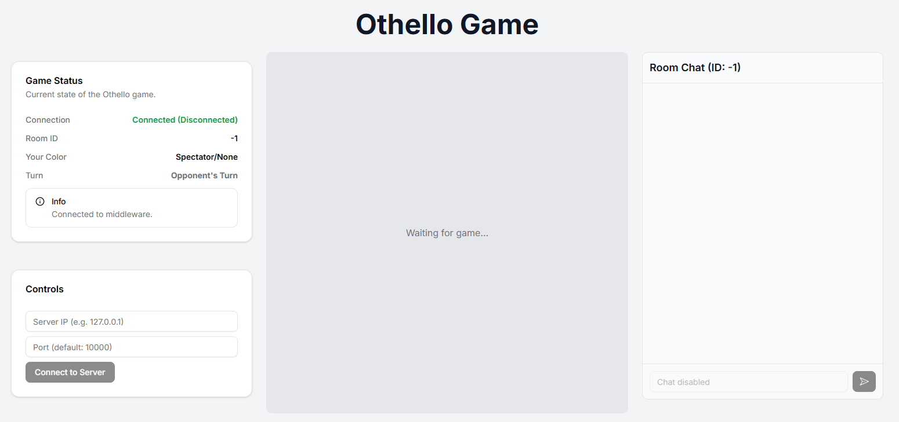
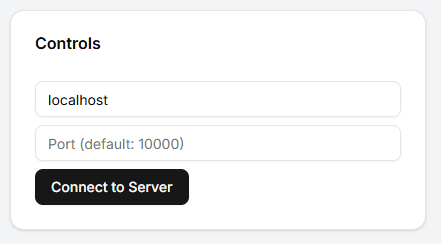
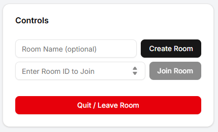
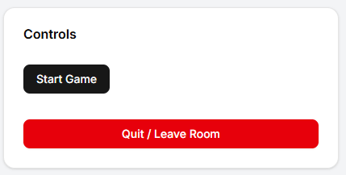
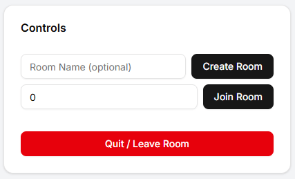
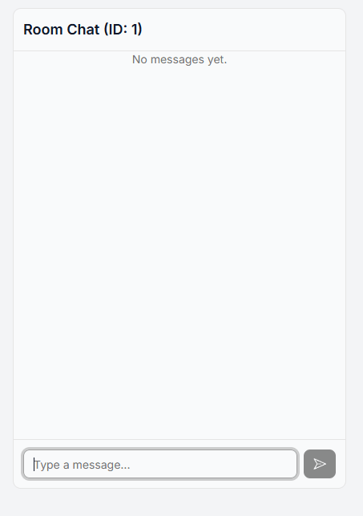
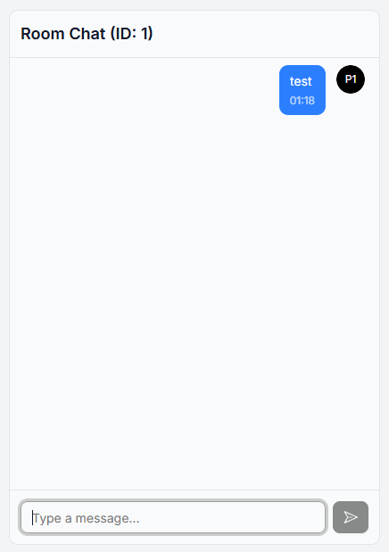

# OnlineOthello 環境構築手順

このプロジェクトは、フロントエンドに Node.js を使用しています。実行には Node.js 環境が必要となるため、**事前に Docker を使ったセットアップ**が必要です。

---

## ✅ 初回セットアップ

1. **Docker Desktop を起動**してください。
2. 過去に作成された以下の Docker リソースがある場合は **削除してください**:
   - コンテナ：`networkA`
   - イメージ：`ubuntu_net:24.04`

3. 本リポジトリのルートにあるシェルスクリプト、または PowerShell スクリプトを実行して環境を構築します。

### Mac / Linux の場合

```bash
./run_networkA.sh
```

### Windows (PowerShell) の場合

```bash
.\run_networkA.ps1
```

セットアップスクリプトを実行すると、以下が自動的に行われます：

- 必要な Docker イメージの構築
- Node.js / npm のインストール
- `npm install` による依存関係のインストール
- `npm run build` によるフロントエンドのビルド
- C言語アプリケーションのコンパイル（`client_app`, `server_app`）

## 🚀 起動方法

### クライアント（フロントエンド）の起動

1. コンテナ内で以下のコマンドを実行してください：

    ```bash
    cd /root/OnlineOthello/client/src/othello-front/
    npm run start
    ```

2. 起動後、ホストマシンのブラウザから以下にアクセスしてください：

    <http://localhost:3000> → Othello をプレイできます。

### サーバーアプリの起動

1. コンテナ内で以下のコマンドを実行してください：

    ```bash
    cd /root/OnlineOthello/server/
    ./server_app.out
    ```

## 🔁 再コンパイルしたいとき

Cアプリケーションを変更した場合は、コンテナ内で次のスクリプトを実行することで再コンパイルできます：

```bash
source build_apps.sh
```

## 📁 ディレクトリ構成（抜粋）

```bash
OnlineOthello/
├── client/
│   └── src/
│       └── othello-front/   # Next.js frontend
│       └── client_app.c     # C client source
├── server/
│   └── src/
│       └── server_app.c     # C server source
├── Dockerfile               # Docker settings
├── build_apps.sh            # 再コンパイル用スクリプト
├── run_networkA.sh          # Unix系起動スクリプト
├── run_networkA.ps1         # Windows用起動スクリプト
```

## 🛠️ 前提

- Docker Desktop がインストールされていること
- ```run_networkA.sh``` または ```run_networkA.ps1``` が実行可能であること

## ⚠️ PowerShell スクリプトが実行できない場合の対処法（Windows）

`run_networkA.ps1` を実行しようとしたときにエラーが出る場合、スクリプト実行ポリシーの制限が原因であることがあります。

### ✅ 方法：一時的に実行ポリシーを変更する

PowerShell を「管理者として実行」し、以下のコマンドを入力してください：

```ps
Set-ExecutionPolicy -Scope Process -ExecutionPolicy Bypass
```

その後、プロジェクトのルートディレクトリで以下を実行します：

```ps
.\run_networkA.ps1
```

この方法は **現在の PowerShell セッションでのみ有効** です（PC全体の設定を変更しないため安全です）。

---

## 🎮 ゲームの操作方法

以下は OnlineOthello の基本的な操作手順です。各ステップに対応する画面キャプチャも合わせてご確認ください。

1. 起動画面
    ゲームを起動すると、以下のスタート画面が表示されます。

    

2. サーバーIPの入力
    ローカル開発環境のサーバーが稼働状態であれば、localhost を入力して接続します。

    

3. 部屋の作成
    「Create Room」ボタンを押すことで、新しい部屋を作成できます。

    

4. 部屋作成後の操作
    部屋に入室した後、部屋の作成者だけが「Start Game」ボタンを押せます。

    

5. 既存の部屋に入る
    他のプレイヤーは、部屋番号（例：0）を入力し、「Join Room」ボタンを押すことで部屋に参加できます。

    

## 💬 チャット機能の使い方

ゲーム中にはチャット機能を使って相手プレイヤーと会話できます。

チャットの入力画面
画面下部にメッセージを入力できます。



メッセージの送信
メッセージ（例：test）を送信すると、画面に表示されます。



## 📌 注意事項

サーバーが起動していないと、IPを入力しても接続できません。

作成された部屋の番号は画面上に表示されます。参加者はその番号を入力してください。

チャットはルーム内のプレイヤー間で共有されます。
